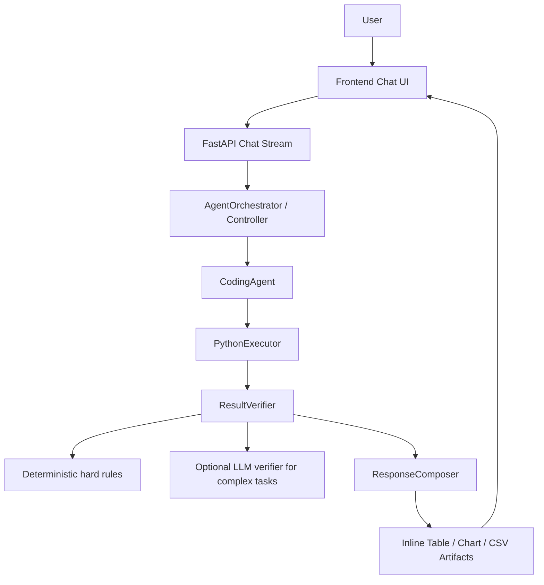

# Data Analysis Agent

A full-stack take-home project for uploading arbitrary `.pkl` datasets and chatting with a
general-purpose Python coding agent that can inspect, transform, visualize, branch, and export data
without assuming schemas.


## Project Overview

Data Analysis Agent is an AI data workspace with:

- A FastAPI backend for sessions, uploads, versioned snapshots, agent execution, artifacts, and CSV export.
- A React/Vite/TypeScript frontend with a polished workspace: datasets and branch history on the left, focused streamed chat in the main view, and an Explore view for profiles, artifacts, charts, CSV export, and selected history details.
- A Python execution runtime that loads session state, runs model-written Python code, captures stdout/errors, persists requested mutations, and stores generated artifacts.
- Branch/fork/rollback history so users can explore destructive transformations without losing prior states.
- Cross-session persistence through SQLite/filesystem storage and frontend session restoration.

## Why This Is A General Coding Agent

This project intentionally avoids a fixed analytics-tool router. The agent has a tiny tool surface:

- `execute_python`
- `final_answer`
- `request_confirmation`

The model writes Python code to inspect arbitrary uploaded objects, observes execution results, and
retries when code fails. There are no hardcoded tools such as `filter_rows`, `group_by`,
`plot_histogram`, `drop_nulls`, or schema-specific handlers. The backend exposes `datasets`,
`data`, `pd`, `np`, and artifact helpers, then persists state as versioned snapshots only when the
agent explicitly requests mutation.

This design lets the same agent handle DataFrames, ndarrays, nested JSON-like objects, custom
classes, mixed collections, and multi-dataset sessions without hardcoded schemas, column names, or
data types.

### External Tool Surface

The external agent tool surface is intentionally minimal:

- `execute_python`
- `final_answer`
- `request_confirmation`

The runtime injects generic helpers that make arbitrary objects inspectable and artifact-friendly.
They are not specialized analytics tools or schema routers:

- `inspect_object`
- `summarize_structure`
- `find_record_collections`
- `get_path`
- `flatten_records_at_path`
- `to_dataframe`
- `object_to_record`
- `objects_to_records`
- `preview`
- `preview_dataframe`
- `save_table`
- `save_chart`
- `save_csv`

## Architecture

The backend now runs a multi-role workflow while keeping the product a single general-purpose
Python coding agent, not a collection of specialized analytics agents:

```text
User
 ↓
Frontend Chat UI
 ↓
FastAPI Chat Stream
 ↓
AgentOrchestrator
 ↓
CodingAgent
 ↓
PythonExecutor
 ↓
ResultVerifier
 ├─ Deterministic rules
 └─ Optional LLM verifier with fallback
 ↓
ResponseComposer
 ↓
Inline Table / Chart / CSV Artifacts
```

The verifier does not turn this into a fixed analytics router. It only checks whether the general
coding agent satisfied the user's request: for example, whether a requested table/chart/CSV artifact
exists, whether wrapper columns leaked into a table, whether a non-mutating request accidentally
changed state, or whether a useful result should be finalized instead of burning the step budget.

If the optional LLM verifier is enabled, it checks semantic completeness from execution summaries and
artifact metadata only. It does not call Python, does not invent data, and cannot override
deterministic hard-rule failures. If it is missing, slow, rate-limited, invalid, or too expensive,
the deterministic verifier is used so demos keep moving. Normal user-facing traces hide verifier
parser exception details; set `SHOW_VERIFIER_DEBUG_TRACE=true` only when debugging locally.

```text
React + Vite + TypeScript
  - upload/dropzone, chat, trace stream, Explore view, inspector, artifacts, branch timeline
  - Server-Sent Events client for streamed agent events
  - localStorage restores the last backend session across browser sessions
  - dismissible notifications and animated collapsible traces/results
  - Markdown chat transcript export with an option to include or omit trace events

FastAPI
  - sessions, datasets, branches, versions, exports, artifacts, confirmations
  - SQLModel metadata in SQLite
  - filesystem storage under backend/.data/

Agent
  - AgentOrchestrator owns the turn loop, streaming, confirmations, verification, and finalization
  - CodingAgent has the tiny tool surface: execute_python, final_answer, request_confirmation
  - CodingAgent writes Python to inspect arbitrary data
  - ResultVerifier checks artifacts, state behavior, known bad patterns, and retry/finalize policy
  - optional LLM verifier checks semantic completeness with deterministic fallback
  - ResponseComposer creates concise markdown answers with highlights and artifact references
  - observes execution output and retries failed or incomplete code up to the configured limit
  - asks clarification questions for ambiguous destructive choices
  - requests confirmation before dangerous writes

Runtime
  - exposes datasets: dict[str, Any] and data: Any active-dataset alias
  - persists mutated datasets as VersionNode snapshots
  - creates table/chart/CSV artifacts
  - captures stdout, stderr, tracebacks, JSON-safe previews
```

## Setup

### Backend

```bash
cd backend
python3.11 -m venv .venv
source .venv/bin/activate
pip install -e ".[dev]"
```

### Frontend

```bash
cd frontend
npm install
```

### Environment Variables

Copy the example file:

```bash
cp .env.example .env
```

Important variables:

```bash
OPENAI_API_KEY=...
OPENAI_MODEL=gpt-4.1
AGENT_MODEL_MODE=openai
AGENT_MAX_STEPS=6
AGENT_MAX_RETRIES=3
VERIFIER_MODE=hybrid
LLM_VERIFIER_ENABLED=true
LLM_VERIFIER_MODEL=gpt-4.1-mini
LLM_VERIFIER_TIMEOUT_SECONDS=6
LLM_VERIFIER_MAX_TOKENS=700
LLM_VERIFIER_FAIL_OPEN=true
SHOW_VERIFIER_DEBUG_TRACE=false
DATABASE_URL=sqlite:///./data_analysis_agent.db
STORAGE_DIR=.data
BACKEND_CORS_ORIGINS=http://localhost:5173,http://127.0.0.1:5173
VITE_API_BASE_URL=http://localhost:8000
```

Use `AGENT_MODEL_MODE=fake`, `AGENT_MODE=fake`, or `FAKE_AGENT_MODE=true` only for deterministic tests/evals without OpenAI API calls. Normal demo/UI runs should use `AGENT_MODEL_MODE=openai`; the frontend health badge warns when fake mode is active so reviewers do not mistake scripted behavior for the real coding agent.

## Run Locally

Terminal 1:

```bash
cd backend
source .venv/bin/activate
uvicorn app.main:app --reload
```

Terminal 2:

```bash
cd frontend
npm run dev
```

Open `http://localhost:5173`.

## Upload Data

Upload one or more `.pkl` files through the dropzone. The backend:

1. Stores the original pickle file.
2. Loads the object.
3. Builds a generic JSON-safe profile.
4. Saves an initial snapshot.
5. Creates an initial `VersionNode` on the `main` branch.
6. Assigns a safe unique dataset key derived from the filename.

Supported examples include DataFrames, Series, ndarrays, nested dict/list values, list-of-dicts,
custom classes, and mixed collections.

## Agent Loop

For each chat request:

1. Backend builds context from dataset profiles, active dataset, active branch, version history,
   conversation history, and artifacts.
2. The model chooses one of the tiny tools.
3. For data work, the model writes Python and calls `execute_python`.
4. The runtime executes the code against current session snapshots.
5. The agent observes stdout, tracebacks, previews, artifacts, and updated dataset versions.
6. If execution fails, the agent retries with traceback context up to 3 attempts.
7. The agent returns `final_answer`.

The agent does not expose hidden chain-of-thought. Only concise public progress traces are streamed.

## Streamed Trace

`POST /api/sessions/{session_id}/chat/stream` returns Server-Sent Events:

- `message_started`
- `trace`
- `code_started`
- `code_result_summary`
- `confirmation_required`
- `artifact_created`
- `final_answer`
- `message_done`
- `error`

The UI renders trace events in a collapsible animated panel and final answers in a visually distinct
card. New trace/code events briefly expand, then fold into a compact summary so long errors such as
timeouts remain inspectable without overwhelming the chat. There is no spinner-only behavior: users
see the agent's public progress as it works.

The Chat view also includes a transcript export control. It downloads the current browser chat as
Markdown and lets the user choose whether streamed trace/code/result events are included.

## Session State And Mutations

Each session stores metadata in SQLite and snapshots/artifacts on disk. The frontend restores the
last session from `localStorage`, and the backend exposes `GET /api/sessions` to reconnect to
persisted sessions.

Mutations only persist when `execute_python` is called with `mutates_state=true`. The runtime detects
changed datasets, saves new pickle snapshots, updates dataset profiles, and appends `VersionNode`
rows. Read-only analysis does not create new versions.

Dangerous writes are paused behind confirmation. Risky operations include dropping rows/columns,
deduplication, overwrites, destructive filtering, normalization overwrites, rollback, and destructive
reshape. Ambiguous destructive requests should produce a clarification question instead of guessing.
Rollback controls in the branch timeline also show a browser confirmation before applying state.

## Branching And Forking

Every dataset starts on `main`. The history model is append-only:

- Rollback creates a new rollback version pointing at an earlier snapshot.
- Fork creates a new branch from a selected version.
- Checkout switches the active branch and restores dataset snapshots.
- Each dataset tracks its own version lineage, so mutating one dataset does not rewrite another.

The left sidebar displays branch state, version summaries, rollback controls, and fork controls.

## Multi-Dataset Support

A session can contain multiple datasets. The executor exposes all of them:

```python
datasets: dict[str, Any]
data: Any  # active dataset alias
```

Dataset keys are safe and unique, for example `users`, `orders`, or `orders_2`. The agent receives
all dataset profiles and keys, can inspect `datasets.keys()`, can compare or join datasets when the
structure allows, and should ask for clarification only when the intended dataset or join key is
truly ambiguous.

## CSV Export

Users can export the current active dataset or requested version with:

```text
POST /api/sessions/{session_id}/export
```

The agent can create intermediate CSVs through:

```python
save_csv("top rows", dataframe_or_records)
```

CSV export reflects the current active branch/version. Intermediate exports do not mutate state.
For non-tabular objects, the backend attempts generic conversion and `pandas.json_normalize`; if CSV
is not useful, it stores a JSON fallback artifact and explains the limitation.

## Visualizations

The runtime exposes:

```python
save_chart(name, chart_spec)
```

Chart specs are validated:

```json
{
  "title": "Revenue by segment",
  "chart_type": "bar",
  "data": [{ "segment": "enterprise", "revenue": 2500 }],
  "x": "segment",
  "y": "revenue",
  "color": "optional_field",
  "description": "Optional subtitle"
}
```

Supported chart types: `bar`, `line`, `pie`, `scatter`, `area`. Large chart data is sampled or
aggregated before saving. The frontend renders chart artifacts inline with Recharts and can export
chart underlying data as CSV.

## Demo Pickles And Tests

Generate deterministic demo pickles:

```bash
cd backend
python scripts/create_demo_pickles.py
```

Generated fixtures:

- `dataframe_transactions.pkl`
- `list_of_dicts_nested.pkl`
- `numpy_array.pkl`
- `custom_objects.pkl`
- `mixed_collection.pkl`
- `multi_dataset_users.pkl`
- `multi_dataset_orders.pkl`

Run tests:

```bash
cd backend
pytest
```

Generate the broader arbitrary-structure eval datasets:

```bash
python backend/scripts/create_agent_test_datasets.py
```

This writes:

- `agent_test_datasets/nested_customer_events.pkl`
- `agent_test_datasets/mixed_dataframe_numpy_bundle.pkl`
- `agent_test_datasets/custom_sensor_fleet.pkl`
- `agent_test_datasets/mixed_top_level_collection.pkl`

Run the automated SoftBank eval against a running backend:

```bash
python backend/scripts/evaluate_agent_demo.py \
  --suite softbank_core \
  --dataset /Users/macbook/Desktop/softbank_group_patent_portfolio_metadata.pkl \
  --base-url http://127.0.0.1:8000 \
  --frontend-url http://localhost:5173 \
  --out backend/eval_reports/final_softbank_core \
  --use-real-agent \
  --require-real-agent \
  --include-screenshots \
  --browser-smoke
```

Run the generated arbitrary-dataset eval:

```bash
python backend/scripts/evaluate_agent_demo.py \
  --suite generated_all \
  --dataset-dir ./agent_test_datasets \
  --base-url http://127.0.0.1:8000 \
  --frontend-url http://localhost:5173 \
  --out backend/eval_reports/final_generated_all \
  --use-real-agent \
  --require-real-agent \
  --include-screenshots \
  --browser-smoke
```

Use `--quick` for a shorter smoke pass, `--approve-mutations` when you intentionally want the
harness to approve dangerous write confirmations, and `--browser-smoke`/`--include-screenshots`
when Playwright is installed and the frontend is running.

Install the browser smoke dependencies once before running screenshot-enabled evals:

```bash
cd backend
python -m pip install '.[dev]'
python -m playwright install chromium

cd ../frontend
npm install
npm run playwright:install
```

Advanced real eval runs browser smoke and subprocess backend-restart persistence checks by default:

```bash
python backend/scripts/evaluate_agent_demo.py \
  --suite advanced_real \
  --dataset /Users/macbook/Desktop/softbank_group_patent_portfolio_metadata.pkl \
  --dataset-dir ./agent_test_datasets \
  --base-url http://127.0.0.1:8000 \
  --frontend-url http://localhost:5173 \
  --out backend/eval_reports/final_advanced_real \
  --use-real-agent \
  --require-real-agent \
  --approval-policy mixed \
  --include-screenshots \
  --browser-smoke
```

Run the dedicated restart-persistence suite:

```bash
python backend/scripts/evaluate_agent_demo.py \
  --suite advanced_real \
  --dataset /Users/macbook/Desktop/softbank_group_patent_portfolio_metadata.pkl \
  --dataset-dir ./agent_test_datasets \
  --base-url http://127.0.0.1:8000 \
  --frontend-url http://localhost:5173 \
  --out backend/eval_reports/final_restart_persistence \
  --use-real-agent \
  --require-real-agent \
  --approval-policy mixed \
  --restart-backend-check \
  --include-screenshots \
  --browser-smoke
```

Use `--skip-browser` or `--skip-restart-persistence` only when you intentionally want to skip those
hard QA gates; skipped gates are reported explicitly.

Each eval run creates:

- `report.md`: human-reviewable pass/fail/warning summary, final answer excerpts, artifacts, trace
  summaries, code snippets, and reviewer notes placeholders.
- `report.json`: machine-readable rubric results.
- `chat_transcript.md`: compact conversation transcript.
- `raw_events/*.json`: complete SSE event logs for every question.
- `screenshots/*.png`: optional frontend screenshots for chart/table/download smoke checks.

The report is designed to help a human decide whether each answer is correct, not merely whether the
API returned a 200. Checks use invariants such as required artifact types, table columns, chart
schema, state-change behavior, verifier retries, forbidden internal error strings, and raw JSON
leakage. Open `report.md` first, inspect failed questions, then open the corresponding
`raw_events/*.json` and screenshot files for detail.

Legacy quick command:

```bash
cd backend
python scripts/evaluate_agent_demo.py \
  --quick \
  --dataset "$E2E_SOFTBANK_PKL_PATH" \
  --base-url http://localhost:8000
```

The full evaluator covers upload/introspection, chat persistence, streaming trace parsing,
generated Python capture, artifact validation, chart smoke checks, mutation confirmation,
cross-session restore checks, CSV export, multi-dataset comparison, LLM-verifier reporting, and
arbitrary-object handling across SoftBank and generated nested/custom/mixed datasets.

## Demo Script

Suggested reviewer flow:

1. Upload `backend/tests/fixtures/generated/dataframe_transactions.pkl`.
2. Ask: "What's in this file?"
3. Ask: "Show me a sample of the data and summarize the schema."
4. Ask: "Drop rows with missing values in the most important identifier field."
5. Answer the clarification if needed, then approve the dangerous write confirmation.
6. Ask: "Now how many rows are left?"
7. Ask: "Create a chart of the top categories."
8. Ask: "Export that chart's underlying table as CSV."
9. Ask: "Rollback to before the drop."
10. Ask: "Fork a new branch and normalize the numeric fields."
11. Upload `multi_dataset_users.pkl` and `multi_dataset_orders.pkl`.
12. Ask: "Upload another dataset and compare them."
13. Ask: "Export the current branch as CSV."

These prompts cover schema inspection, trace streaming, clarification, dangerous write confirmation,
mutation persistence, branch rollback/fork, visualization, artifacts, CSV export, multi-dataset
analysis, and cross-session persistence.

## Requirement And Stretch Goal Checklist

| Capability | Status | Where | Demo |
| --- | --- | --- | --- |
| Arbitrary trusted `.pkl` upload | Done | `backend/app/api/sessions.py`, `backend/app/services/introspection.py` | Upload any fixture or the SoftBank pickle. |
| General coding agent, not tool router | Done | `backend/app/agent/*`, `backend/app/runtime/python_executor.py` | Ask open-ended data questions; the LLM writes Python against `datasets`/`data`. |
| Minimal external tools | Done | `backend/app/agent/tools.py` | External tools stay `execute_python`, `final_answer`, `request_confirmation`. |
| Streamed trace events | Done | SSE chat endpoint and `ChatThread` | Ask "What's in this file?" and watch trace/code/verifier events stream. |
| Distinct final answer | Done | `ResponseComposer`, frontend final answer card | Final answer renders separately from trace. |
| Write persistence | Done | `VersionNode` snapshots and branch pointers | Mutate, then ask a follow-up count question. |
| Session/chat persistence | Done | `ChatMessage`, `GET /api/sessions/{id}/messages`, localStorage/URL restore | Refresh or restart backend and reload `?session=...`. |
| CSV export | Done | `save_csv`, export endpoints, artifact cards | Export current branch or an intermediate artifact. |
| Inline visualizations | Done | `save_chart`, Recharts artifact cards | Ask for country or filing-year charts. |
| Multi-dataset sessions | Done | dataset registry, executor `datasets` namespace | Upload users/orders fixtures and compare them. |
| Branch/fork history | Done | branch/history endpoints and timeline UI | Fork, rollback, and switch branches. |
| Dangerous write confirmation | Done | pending confirmations and polished modal | Ask "delete last 500 entries". |
| Clarification questions | Done | controller preflight and agent prompt | Ask "Remove bad records." |
| Cross-session reload persistence | Done | SQLite + filesystem + Recent Sessions UI | Restore an older saved session from the sidebar. |

## Persistence QA

1. Start backend and frontend.
2. Upload `softbank_group_patent_portfolio_metadata.pkl`.
3. Ask: "What's in this file?"
4. Ask: "delete last 500 entries" and approve the confirmation.
5. Ask: "How many records are in the current dataset now?" Expected: 23,910 if the original had 24,410 records.
6. Refresh the browser. The previous messages, trace summaries, artifacts, active dataset, branch, and current version should restore.
7. Stop and restart the backend, then reload the same `?session=<id>` URL. Messages, artifacts, branch, version, and mutated row count should still restore.
8. Click **New conversation**. A blank session should start, while the old session remains in **Recent sessions**.
9. Click the old session in **Recent sessions**. The old chat and mutated state should return.

## Multi-Role Agent Workflow



The verifier does not turn the project into a fixed analytics router. It checks whether the
general-purpose coding agent satisfied the request: required artifacts exist, wrapper columns are
not leaking, state changes match user intent, and complex semantic/schema tasks can receive one
selective LLM verifier pass. If the LLM verifier is slow, unavailable, invalid, or disabled, the
deterministic verifier remains the source of truth.

## Security Notes

Pickle is unsafe for untrusted files. Loading pickle can execute arbitrary code during
deserialization. This take-home assumes trusted demo files.

Generated Python execution is also not a secure sandbox. The runtime uses a child process, timeouts,
basic import restrictions, and socket blocking, but production use should run pickle loading and
Python execution in isolated workers or containers with OS-level CPU, memory, network, filesystem,
and process limits.

### Timeout Configuration

Runtime timeout values are exposed through environment-backed settings and `/health/config`:

| Setting | Default | Purpose |
| --- | ---: | --- |
| `PYTHON_EXECUTION_TIMEOUT_SECONDS` | 60 | Child-process timeout for generic `execute_python` code. |
| `MUTATION_PERSIST_TIMEOUT_SECONDS` | 120 | Reserved budget for optimized mutation persistence paths. |
| `LLM_VERIFIER_TIMEOUT_SECONDS` | 8 | Optional semantic verifier API call timeout. |
| `VERIFIER_TIME_BUDGET_PER_TURN_SECONDS` | 8 | Per-turn verifier budget before falling back to deterministic checks. |
| `AGENT_MAX_STEPS` | 6 | Maximum coding/verifier loop steps per turn. |
| `AGENT_MAX_RETRIES` | 3 | Maximum retries after verifier or code failures. |

### Generic Optimized Mutation Framework

Clear destructive edits are converted into an internal `MutationSpec` before the coding agent runs.
This keeps the external tool surface unchanged while avoiding slow generated Python for common
state changes. The optimized path discovers record collections and fields across top-level lists,
DataFrames, dicts of DataFrames, nested dict/list data, and custom root objects with nested
collections. It then performs a full impact scan, shows affected counts and examples in the
confirmation card, and applies the change through versioned snapshot persistence after approval.

Examples handled by the controller-level framework:

- `delete all non Japan entries` / `keep only JP records`
- `keep only granted patents`
- `drop refunded orders`
- `remove orders with gross_revenue below 100`
- `remove readings with battery_pct below 20`
- `keep only enterprise customers`
- `remove records with missing title`
- `drop duplicate records by country, doc_number, kind, and title`
- `add filing_year based on filing_date and persist it`

If the parser cannot confidently identify the target collection, field, operator, or value, it asks
for clarification instead of mutating. Vague requests such as "remove bad records" and ambiguous
field/value requests such as "delete all non active entries" remain clarification flows. Optimized
mutations do not invoke `execute_python`, so they do not depend on increasing the Python execution
timeout.

## Tested Data Shapes

Final validation covered:

- SoftBank patent portfolio custom metadata objects.
- Nested customer event dictionaries with customers, purchase events, items, support tickets, and risk flags.
- Dicts containing pandas DataFrames plus NumPy arrays.
- A custom `SensorFleet` class with nested readings, metrics, locations, and alerts.
- Mixed top-level collections containing dicts, DataFrames, ndarrays, nested records, and tuples.

## Artifact Rendering

Assistant messages render final markdown, compact trace summaries, and inline artifacts:

- Table cards preserve full artifact rows/columns while allowing the UI to display a compact preview.
- Chart cards render bar, line, pie, scatter, and area specs with visible error cards for invalid specs.
- CSV cards expose download URLs and preserve identifier fields as strings.
- Artifacts, messages, traces, active dataset, active branch, and active version persist across browser refresh and backend restart.

## Recommended Live Demo

1. Upload `/Users/macbook/Desktop/softbank_group_patent_portfolio_metadata.pkl`.
2. Ask: "What's in this file?"
3. Ask: "Convert this dataset into a tabular preview if possible. Show the inferred columns and the first 5 rows."
4. Ask: "Create a bar chart showing the number of patent records by country."
5. Ask: "Show the top 10 countries by record count as a table, then create a bar chart from the same data."
6. Ask: "Export the top 10 countries table as CSV without changing the dataset."
7. Ask: "Remove bad records." The agent should ask for clarification and not mutate state.
8. Ask: "delete last 500 entries." Reject once and verify the row count remains unchanged.
9. Ask again, approve, and verify the row count changes from 24,410 to 23,910.
10. Ask: "Show me the mutation history so far."
11. Ask: "Roll back to the original uploaded dataset." Approve and verify the row count returns to 24,410.
12. Refresh the browser and verify messages, artifacts, active dataset, branch, and version restore.
13. Click **New conversation**, then restore the old session from **Recent sessions**.

## Latest Validation

Latest validation baseline before this change: `1837f6c7a93d03c56c5cc3d4deb2653058eaba93`.

Final pre-submission validation was run in real-agent mode against `http://127.0.0.1:8000` and `http://localhost:5173` with `FAKE_AGENT_MODE=false`, `AGENT_MODEL_MODE=openai`, `VERIFIER_MODE=hybrid`, and `LLM_VERIFIER_POLICY=selective`.

| Check | Result |
| --- | --- |
| Backend lint | `ruff check app tests scripts` passed |
| Backend tests | `166 passed` |
| Frontend build | `npm run build` passed |
| Frontend lint | `npm run lint` passed |
| SoftBank core eval | `14 passed`, `1 warning`, `0 failed` at `backend/eval_reports/final_softbank_core/report.md` |
| Generated arbitrary datasets eval | `31 passed`, `0 warnings`, `0 failed` at `backend/eval_reports/final_generated_all/report.md` |
| Advanced real eval | `13 passed`, `0 warnings`, `0 failed` at `backend/eval_reports/final_advanced_real/report.md` |
| Restart persistence eval | `13 passed`, `0 warnings`, `0 failed` at `backend/eval_reports/final_restart_persistence/report.md` |
| Browser smoke/screenshots | Passed; screenshots saved under each final report directory |
| Secret scan | `git grep` checks found no committed API key or key fragment |

The SoftBank core warning is expected for that suite because it does not request the restart-persistence special check. The dedicated restart suite performs the subprocess backend restart workflow and passes.

Current implementation limitations:

- No authentication or multi-user tenancy.
- No production-grade sandbox.
- SQLite/filesystem storage is appropriate for demo/local use, not high-concurrency production.
- Real model behavior depends on prompt following; critical destructive workflows should add deeper
  policy enforcement.
- Frontend session restore assumes a trusted single-user browser; there is no account-level session
  isolation.

## Tradeoffs

- A tiny tool surface keeps the agent general, but model-written code can be less predictable than
  curated analytics tools.
- Snapshotting pickle state is simple and flexible, but not storage-efficient for very large data.
- Generic introspection handles many object shapes, but exotic objects may still produce partial
  previews.
- Confirmation is enforced for recognized risky code patterns and rollback; deeper semantic diffing
  would make the risk review stronger.

## Future Improvements

- Containerized execution sandbox with resource quotas.
- Authentication and per-user session ownership.
- Rich version diffs across arbitrary objects.
- Background job queue for large pickle uploads and long-running analysis.
- More granular risk previews before destructive mutations.
- Server-side session naming/renaming beyond the first-message auto-title.
- Better chart recommendation feedback and artifact provenance.
