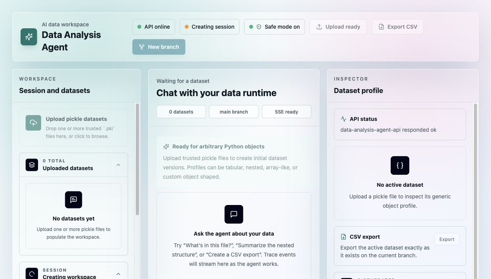

# Data Analysis Agent

A full-stack take-home project for uploading arbitrary `.pkl` datasets and chatting with a
general-purpose Python coding agent that can inspect, transform, visualize, branch, and export data
without assuming schemas.



## Project Overview

Data Analysis Agent is an AI data workspace with:

- A FastAPI backend for sessions, uploads, versioned snapshots, agent execution, artifacts, and CSV export.
- A React/Vite/TypeScript frontend with a three-panel data workspace: datasets and branch history on the left, streamed chat in the center, and inspector/artifacts on the right.
- A Python execution runtime that loads session state, runs model-written Python code, captures stdout/errors, persists requested mutations, and stores generated artifacts.
- Branch/fork/rollback history so users can explore destructive transformations without losing prior states.
- Cross-session persistence through SQLite/filesystem storage and frontend session restoration.

## Why This Is A General Coding Agent

This project intentionally avoids a fixed analytics-tool router. The agent has a tiny tool surface:

- `execute_python`
- `final_answer`
- `request_confirmation`

The model writes Python code to inspect arbitrary uploaded objects, observes execution results, and
retries when code fails. There are no hardcoded tools such as `filter_rows`, `group_by`,
`plot_histogram`, `drop_nulls`, or schema-specific handlers. The backend exposes `datasets`,
`data`, `pd`, `np`, and artifact helpers, then persists state as versioned snapshots only when the
agent explicitly requests mutation.

This design lets the same agent handle DataFrames, ndarrays, nested JSON-like objects, custom
classes, mixed collections, and multi-dataset sessions without hardcoded schemas, column names, or
data types.

## Architecture

```text
React + Vite + TypeScript
  - upload/dropzone, chat, trace stream, inspector, artifacts, branch timeline
  - Server-Sent Events client for streamed agent events
  - localStorage restores the last backend session across browser sessions

FastAPI
  - sessions, datasets, branches, versions, exports, artifacts, confirmations
  - SQLModel metadata in SQLite
  - filesystem storage under backend/.data/

Agent
  - tiny tool surface: execute_python, final_answer, request_confirmation
  - writes Python to inspect arbitrary data
  - observes execution output and retries failed code up to 3 attempts
  - asks clarification questions for ambiguous destructive choices
  - requests confirmation before dangerous writes

Runtime
  - exposes datasets: dict[str, Any] and data: Any active-dataset alias
  - persists mutated datasets as VersionNode snapshots
  - creates table/chart/CSV artifacts
  - captures stdout, stderr, tracebacks, JSON-safe previews
```

## Setup

### Backend

```bash
cd backend
python3.11 -m venv .venv
source .venv/bin/activate
pip install -e ".[dev]"
```

### Frontend

```bash
cd frontend
npm install
```

### Environment Variables

Copy the example file:

```bash
cp .env.example .env
```

Important variables:

```bash
OPENAI_API_KEY=...
OPENAI_MODEL=gpt-4.1
AGENT_MODEL_MODE=openai
DATABASE_URL=sqlite:///./data_analysis_agent.db
STORAGE_DIR=.data
BACKEND_CORS_ORIGINS=http://localhost:5173,http://127.0.0.1:5173
VITE_API_BASE_URL=http://localhost:8000
```

Use `AGENT_MODEL_MODE=fake` for deterministic local/testing behavior without OpenAI API calls.

## Run Locally

Terminal 1:

```bash
cd backend
source .venv/bin/activate
uvicorn app.main:app --reload
```

Terminal 2:

```bash
cd frontend
npm run dev
```

Open `http://localhost:5173`.

## Upload Data

Upload one or more `.pkl` files through the dropzone. The backend:

1. Stores the original pickle file.
2. Loads the object.
3. Builds a generic JSON-safe profile.
4. Saves an initial snapshot.
5. Creates an initial `VersionNode` on the `main` branch.
6. Assigns a safe unique dataset key derived from the filename.

Supported examples include DataFrames, Series, ndarrays, nested dict/list values, list-of-dicts,
custom classes, and mixed collections.

## Agent Loop

For each chat request:

1. Backend builds context from dataset profiles, active dataset, active branch, version history,
   conversation history, and artifacts.
2. The model chooses one of the tiny tools.
3. For data work, the model writes Python and calls `execute_python`.
4. The runtime executes the code against current session snapshots.
5. The agent observes stdout, tracebacks, previews, artifacts, and updated dataset versions.
6. If execution fails, the agent retries with traceback context up to 3 attempts.
7. The agent returns `final_answer`.

The agent does not expose hidden chain-of-thought. Only concise public progress traces are streamed.

## Streamed Trace

`POST /api/sessions/{session_id}/chat/stream` returns Server-Sent Events:

- `message_started`
- `trace`
- `code_started`
- `code_result_summary`
- `confirmation_required`
- `artifact_created`
- `final_answer`
- `message_done`
- `error`

The UI renders trace events in a collapsible panel and final answers in a visually distinct card.
There is no spinner-only behavior: users see the agent's public progress as it works.

## Session State And Mutations

Each session stores metadata in SQLite and snapshots/artifacts on disk. The frontend restores the
last session from `localStorage`, and the backend exposes `GET /api/sessions` to reconnect to
persisted sessions.

Mutations only persist when `execute_python` is called with `mutates_state=true`. The runtime detects
changed datasets, saves new pickle snapshots, updates dataset profiles, and appends `VersionNode`
rows. Read-only analysis does not create new versions.

Dangerous writes are paused behind confirmation. Risky operations include dropping rows/columns,
deduplication, overwrites, destructive filtering, normalization overwrites, rollback, and destructive
reshape. Ambiguous destructive requests should produce a clarification question instead of guessing.

## Branching And Forking

Every dataset starts on `main`. The history model is append-only:

- Rollback creates a new rollback version pointing at an earlier snapshot.
- Fork creates a new branch from a selected version.
- Checkout switches the active branch and restores dataset snapshots.
- Each dataset tracks its own version lineage, so mutating one dataset does not rewrite another.

The left sidebar displays branch state, version summaries, rollback controls, and fork controls.

## Multi-Dataset Support

A session can contain multiple datasets. The executor exposes all of them:

```python
datasets: dict[str, Any]
data: Any  # active dataset alias
```

Dataset keys are safe and unique, for example `users`, `orders`, or `orders_2`. The agent receives
all dataset profiles and keys, can inspect `datasets.keys()`, can compare or join datasets when the
structure allows, and should ask for clarification only when the intended dataset or join key is
truly ambiguous.

## CSV Export

Users can export the current active dataset or requested version with:

```text
POST /api/sessions/{session_id}/export
```

The agent can create intermediate CSVs through:

```python
save_csv("top rows", dataframe_or_records)
```

CSV export reflects the current active branch/version. Intermediate exports do not mutate state.
For non-tabular objects, the backend attempts generic conversion and `pandas.json_normalize`; if CSV
is not useful, it stores a JSON fallback artifact and explains the limitation.

## Visualizations

The runtime exposes:

```python
save_chart(name, chart_spec)
```

Chart specs are validated:

```json
{
  "title": "Revenue by segment",
  "chart_type": "bar",
  "data": [{ "segment": "enterprise", "revenue": 2500 }],
  "x": "segment",
  "y": "revenue",
  "color": "optional_field",
  "description": "Optional subtitle"
}
```

Supported chart types: `bar`, `line`, `pie`, `scatter`, `area`. Large chart data is sampled or
aggregated before saving. The frontend renders chart artifacts inline with Recharts and can export
chart underlying data as CSV.

## Demo Pickles And Tests

Generate deterministic demo pickles:

```bash
cd backend
python scripts/create_demo_pickles.py
```

Generated fixtures:

- `dataframe_transactions.pkl`
- `list_of_dicts_nested.pkl`
- `numpy_array.pkl`
- `custom_objects.pkl`
- `mixed_collection.pkl`
- `multi_dataset_users.pkl`
- `multi_dataset_orders.pkl`

Run tests:

```bash
cd backend
pytest
```

The suite covers upload/introspection, chat, mutation persistence, rollback, fork, CSV export after
mutation, chart artifact creation, multi-dataset comparison, executor retry recovery, confirmation,
and clarification behavior. If
`/Users/macbook/Desktop/softbank_group_patent_portfolio_metadata.pkl` exists, it is also uploaded as
a local smoke test for external custom-class pickle data.

## Demo Script

Suggested reviewer flow:

1. Upload `backend/tests/fixtures/generated/dataframe_transactions.pkl`.
2. Ask: "What's in this file?"
3. Ask: "Show me a sample of the data and summarize the schema."
4. Ask: "Drop rows with missing values in the most important identifier field."
5. Answer the clarification if needed, then approve the dangerous write confirmation.
6. Ask: "Now how many rows are left?"
7. Ask: "Create a chart of the top categories."
8. Ask: "Export that chart's underlying table as CSV."
9. Ask: "Rollback to before the drop."
10. Ask: "Fork a new branch and normalize the numeric fields."
11. Upload `multi_dataset_users.pkl` and `multi_dataset_orders.pkl`.
12. Ask: "Upload another dataset and compare them."
13. Ask: "Export the current branch as CSV."

These prompts cover schema inspection, trace streaming, clarification, dangerous write confirmation,
mutation persistence, branch rollback/fork, visualization, artifacts, CSV export, multi-dataset
analysis, and cross-session persistence.

## Requirement And Stretch Goal Checklist

- Generic arbitrary pickle upload: done.
- General coding agent rather than fixed analytics router: done.
- Minimal tools: done.
- Streamed intermediate trace events: done.
- Final answer visually distinct from trace: done.
- Mutations persist across turns: done.
- CSV export reflects current session state or intermediate result: done.
- Inline visualizations: done.
- Multi-dataset sessions: done.
- Forking/branching mutation history: done.
- Dangerous mutation confirmation: done.
- Cross-session persistence: done via SQLite/filesystem plus frontend restore and `GET /api/sessions`.
- Clarification before ambiguous dangerous writes: done through prompt behavior and fake-agent tests.

## Security Notes

Pickle is unsafe for untrusted files. Loading pickle can execute arbitrary code during
deserialization. This take-home assumes trusted demo files.

Generated Python execution is also not a secure sandbox. The runtime uses a child process, timeouts,
basic import restrictions, and socket blocking, but production use should run pickle loading and
Python execution in isolated workers or containers with OS-level CPU, memory, network, filesystem,
and process limits.

Current implementation limitations:

- No authentication or multi-user tenancy.
- No production-grade sandbox.
- SQLite/filesystem storage is appropriate for demo/local use, not high-concurrency production.
- Real model behavior depends on prompt following; critical destructive workflows should add deeper
  policy enforcement.
- Frontend session restore assumes a trusted single-user browser.

## Tradeoffs

- A tiny tool surface keeps the agent general, but model-written code can be less predictable than
  curated analytics tools.
- Snapshotting pickle state is simple and flexible, but not storage-efficient for very large data.
- Generic introspection handles many object shapes, but exotic objects may still produce partial
  previews.
- Confirmation is enforced for recognized risky code patterns and rollback; deeper semantic diffing
  would make the risk review stronger.

## Future Improvements

- Containerized execution sandbox with resource quotas.
- Authentication and per-user session ownership.
- Rich version diffs across arbitrary objects.
- Background job queue for large pickle uploads and long-running analysis.
- More granular risk previews before destructive mutations.
- Persisted conversation history and named saved demo workspaces.
- Better chart recommendation feedback and artifact provenance.
